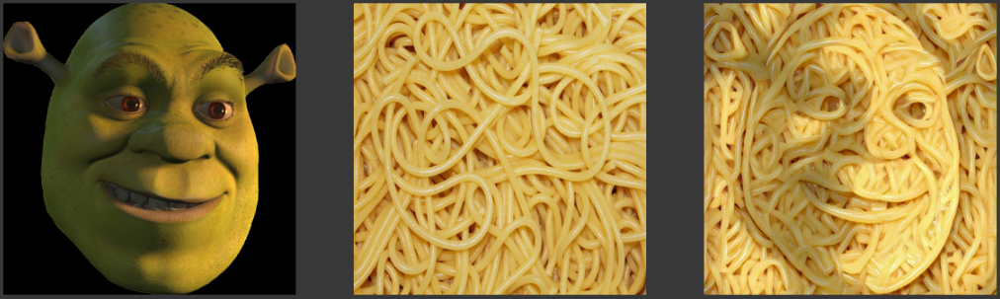
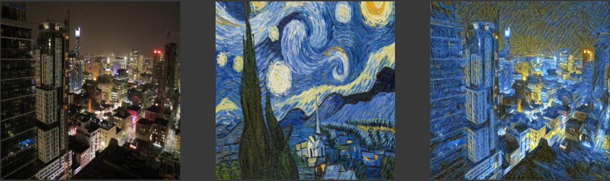

# Style Transfer

Simple Style Transfer using PyTorch

## Spaghetti Shrek

Left image is the content image, Middle Image is the style image, and the right image is the style transfer applied resultant image

## Starry City

Left image is the content image, Middle Image is the style image, and the right image is the style transfer applied resultant image

## Requirements

Python 3 and necessary libraries given in requirements.txt

Install the required libraries using the pip package manager.

For pip version 19.1 or above:

`pip install -r requirements.txt --user`

(or)

`pip3 install -r requirements.txt --user`
